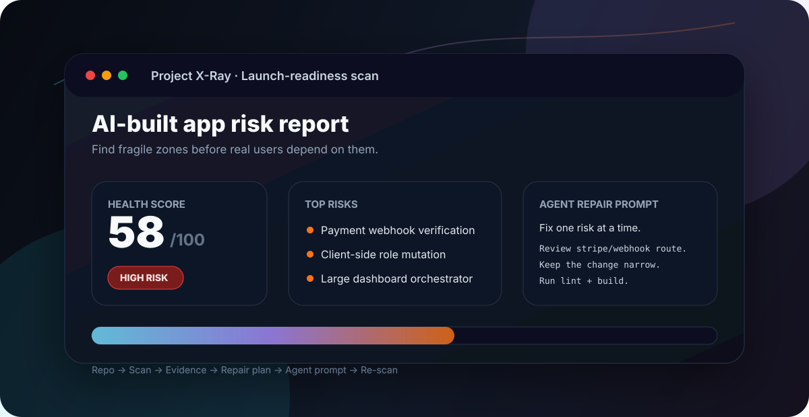

# Project X-Ray

**AI-built app? Find the fragile parts before users do.**

Project X-Ray scans repositories created or heavily modified with Claude Code, Codex, Cursor, Grok, Lovable, Bolt, v0, and other AI coding tools.

It finds launch-readiness risks: weak access boundaries, auth/billing coupling, browser-side mutations, missing ownership checks, oversized orchestration files, duplicated business logic, and temporary AI patches that quietly become production architecture.

<p align="center">
  
</p>

<p align="center">
  
  
  
  
  
</p>

> You built fast with AI coding agents. The demo works. Project X-Ray helps you see what deserves review before real users depend on it.

---

## Pick your path

| I want to... | Start here |
|---|---|
| Scan an AI-built repository | [Quick start](#quick-start) |
| Understand what X-Ray checks | [What Project X-Ray checks](#what-project-x-ray-checks) |
| See the report format | [Example output](#example-output) |
| Use it inside a chat or IDE agent | [Skill mode](#skill-mode) |
| Repair issues with Claude Code, Codex, Cursor, or Grok | [Agent repair workflow](#agent-repair-workflow) |
| Understand the current privacy model | [Privacy model](#privacy-model) |

## What you get

- **Health score** — a `0-100` launch-readiness signal.
- **Verdict** — `Ready`, `Caution`, or `High Risk`.
- **Top risks** — the most important findings to verify first.
- **Risk zones** — files and subsystems that deserve manual review.
- **Plain-language impact** — what can break and why it matters for the product.
- **Repair plan** — small, scoped tasks instead of broad rewrites.
- **Agent repair prompts** — prompts you can give to Claude Code, Codex, Cursor, Grok, or another coding agent.
- **Markdown export** — reports that can be saved, shared, or pasted into an issue.

## Why Project X-Ray exists

AI coding tools make it easy to build a working prototype.

They also make it easy to accidentally ship:

- auth logic mixed into UI;
- payment state changed from browser-controlled code;
- database writes without ownership checks;
- huge files that nobody wants to touch;
- duplicated business rules across unrelated components;
- temporary AI fixes that become production architecture.

Project X-Ray exists for the moment after the demo works — but before real users depend on it.

## Who it is for

Project X-Ray is designed for:

- founders and solo builders shipping AI-built MVPs;
- developers using coding agents for real product work;
- consultants reviewing client prototypes before handoff;
- teams adopting AI-assisted development and needing a lightweight safety layer;
- anyone who needs a practical repair plan before launch.

## What Project X-Ray checks

Project X-Ray uses a deterministic browser-side rule engine. The current rule set focuses on structural and launch-critical risks:

1. Protected route exposure.
2. Auth and billing coupling.
3. Fragile payment webhook handling.
4. Client-side mutation of roles, prices, permissions, or access.
5. Database access without an obvious ownership or RLS boundary.
6. Server-only value exposure to browser code.
7. Oversized files.
8. Repeated business or access logic.
9. TODO/FIXME/HACK markers in critical flows.
10. Mixed responsibilities in one module.
11. Sensitive update/delete operations without clear ownership checks.
12. Missing error handling around access, payment, database, or external APIs.
13. Missing success, cancel, onboarding, or account-status paths.
14. Sensitive modules imported across too many places.
15. Composite AI-chaos smell: large file plus temporary fixes plus mixed responsibilities plus critical flow.

See [docs/scoring-model.md](docs/scoring-model.md) for the scoring model.

## How it works

```text
Repository
   ↓
Structural risk scan
   ↓
Health score + verdict
   ↓
Top risks with evidence
   ↓
Repair plan
   ↓
Small prompts for Claude Code / Codex / Cursor / Grok
   ↓
Re-scan after fixes
```

Project X-Ray is designed to work with AI coding agents, not compete with them.

## Example output

A typical scan returns:

```text
Health score: 58 / 100
Verdict: High Risk

Top risks:
1. Payment event handling needs verification review
2. Account access changes are too close to browser code
3. Large mixed-responsibility dashboard file

Recommended next step:
Review launch blockers first, then split fragile orchestration files into smaller modules.
```

See [examples/xray-report-example.md](examples/xray-report-example.md) for a full sample report.

## Skill mode

Project X-Ray also ships as a reusable LLM skill:

```text
skills/ai-project-xray/SKILL.md
```

Use it when you want a model to run the same audit workflow in a chat, IDE agent, or repository-review flow.

The skill is intentionally focused on one repeatable task: **audit an AI-built project for launch-readiness and fragility risks, then produce a repair plan.**

The skill follows current agent-workflow practices:

- clear activation criteria;
- specific required inputs;
- progressive disclosure through supporting docs and examples;
- evidence-based findings;
- explicit confidence levels;
- small repair prompts instead of large rewrites;
- verification steps after each proposed change.

## Agent repair workflow

Recommended loop:

1. Scan the repository.
2. Review top risks manually.
3. Export repair tasks.
4. Give one small repair prompt to a coding agent.
5. Run lint, build, and tests.
6. Re-scan.
7. Repeat.

Bad repair prompt:

```text
Refactor the whole app and fix everything risky.
```

Good repair prompt:

```text
Review `app/api/stripe/webhook/route.ts` and improve payment event verification. Do not change unrelated billing logic. Keep the change narrow. Return clear error responses for invalid events. After the change, run `npm run lint` and `npm run build`.
```

For a more detailed repair loop, see [docs/agent-repair-workflow.md](docs/agent-repair-workflow.md).

## Privacy model

Project X-Ray is browser-first.

- Public repositories can be scanned without signing in.
- Private repositories require GitHub OAuth.
- Repository code is fetched through the GitHub API.
- Project X-Ray does not store repository code.
- Local scan history is stored in the browser.

Important security note: the current browser-first design exposes the GitHub access token to the browser session so the client can call GitHub directly. This preserves the zero-backend architecture, but browser-side XSS would be high impact. For a production SaaS, add a server-side GitHub proxy mode.

## Requirements

- Node.js compatible with Next.js 16.
- npm.
- A GitHub OAuth App for private repository access.
- Optional xAI API key for generated repair prompts.

## Quick start

```bash
npm install
npm run dev
```

Open the URL printed by Next.js, usually:

```text
http://localhost:3000
```

## GitHub OAuth

If you run your own copy of Project X-Ray, create a GitHub OAuth App:

1. Open `https://github.com/settings/applications/new`.
2. Set the Homepage URL to the URL where Project X-Ray is running.
3. Set the Authorization callback URL to:

```text
http://localhost:3000/api/auth/callback/github
```

For production, replace `http://localhost:3000` with your deployed domain.

Then create `.env.local`:

```env
AUTH_GITHUB_ID=...
AUTH_GITHUB_SECRET=...
AUTH_SECRET=...
```

Project X-Ray requests the GitHub scopes `read:user repo` through Auth.js so it can read private repositories that the signed-in GitHub user can access.

## Optional xAI/Grok setup

Prompt generation uses deterministic fallback text by default. To enable xAI/Grok prompt generation, add:

```env
XAI_API_KEY=...
```

The core scanner does not require an LLM API key.

## Architecture

- `app/page.tsx` — main scanner UI and orchestration.
- `lib/github.ts` — GitHub API calls and repository file selection.
- `lib/xray-analyzer.ts` — deterministic rule engine.
- `lib/scan-history.ts` — browser localStorage scan history.
- `components/` — reusable result views and UI surfaces.
- `skills/ai-project-xray/` — portable LLM skill workflow.
- `docs/` — scoring model and launch docs.
- `examples/` — example reports and future demo repositories.

## Development

Run checks before opening a pull request:

```bash
npm run lint
npm run build
```

## Roadmap

Near-term:

- [ ] Replace the SVG preview with a real screenshot or demo GIF.
- [ ] Add server-side GitHub proxy mode.
- [ ] Add CLI mode.
- [ ] Add intentionally fragile demo repository.
- [ ] Add framework-specific rule packs: Next.js, Supabase, Stripe, Firebase.
- [ ] Add `AGENTS.md` / `CLAUDE.md` repair task export.
- [ ] Add false-positive verification workflow.
- [ ] Add before/after scan comparison.

Longer-term:

- [ ] Pull request risk analysis.
- [ ] AI-edit regression detection.
- [ ] Rule pack marketplace.
- [ ] Team audit history.
- [ ] CI mode for launch gates.

## What Project X-Ray is not

Project X-Ray is not:

- a full security audit;
- a replacement for tests;
- a replacement for manual architecture review;
- a static analysis competitor;
- a style or formatting checker;
- a guarantee that a project is production-safe.

It is a practical early-warning system for AI-assisted product development.

## License

MIT. See [LICENSE](LICENSE).
